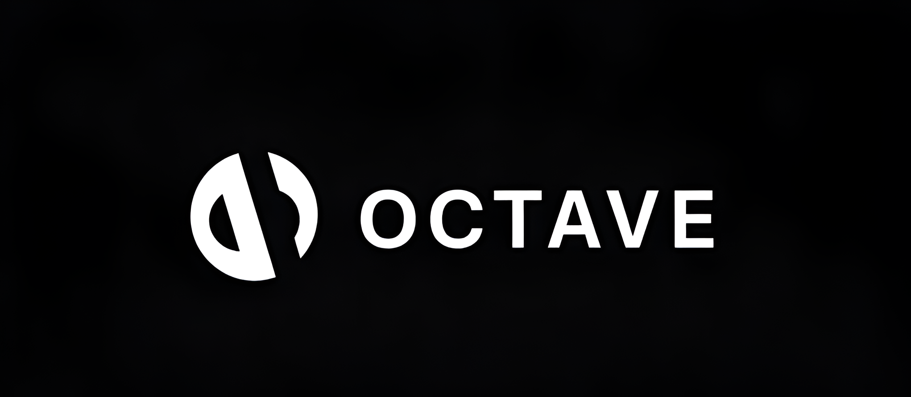

<div align="center">
  

  # Octave - Your Ultimate Music Companion
  
  > A feature-rich music streaming platform that puts you in control of your listening experience.
  
  Experience premium music streaming features without the premium price tag. Available on desktop and mobile through our sleek Progressive Web App.

  [](https://beta.octave.gold)
  [](https://discord.gg/streamflix)

  [](https://patreon.com/octaveapps)
  [](https://www.buymeacoffee.com/octaveapps)

  [](https://github.com/octave-music/frontend)
</div>

## ✨ Why Octave?

Experience music streaming without compromises. Octave delivers premium features completely free:

- 🎵 **Pure Listening Experience**
  - Ad-free streaming
  - Unlimited track skips
  - Premium audio quality
  - Offline playback support

- 📱 **Cross-Platform Excellence**
  - Progressive Web App (PWA) for mobile
  - Responsive desktop interface
  - Seamless device switching

- 🎯 **Smart Features**
  - AI-powered music recommendations
  - Discord Rich Presence integration
  - Advanced playlist management
  - Comprehensive queue control

## 🚀 Quick Start

Get up and running with Octave in minutes:

```bash
# Clone the repository
git clone https://github.com/octave-music/frontend.git

# Navigate to project directory
cd frontend

# Install dependencies
pnpm install

# Start development server
pnpm dev
```

## 💻 Development Commands

```bash
pnpm dev      # Launch development server
pnpm build    # Create production build
pnpm start    # Start production server
pnpm lint     # Run code linting
```

## 📁 Project Architecture

```
frontend/
├── public/               # Static assets
│   ├── images/
│   └── manifest.json
├── src/
│   ├── app/             # App routes
│   ├── components/      # UI components
│   ├── lib/            # Utilities
│   └── pages/          # Page components
├── next.config.mjs      # Next.js config
└── tailwind.config.ts   # Styling config
```

## 🛠️ Technology Stack

- **Frontend Framework**: Next.js
- **Styling**: Tailwind CSS
- **Language**: TypeScript
- **Package Manager**: pnpm
- **PWA Support**: Built-in

## 🤝 Contributing

We welcome contributions! Here's how you can help:

1. Fork the repository
2. Create your feature branch (`git checkout -b feature/AmazingFeature`)
3. Commit your changes (`git commit -m 'Add some AmazingFeature'`)
4. Push to the branch (`git push origin feature/AmazingFeature`)
5. Open a Pull Request

## 📄 License

Distributed under the MIT License. See `LICENSE` for more information.

## 💝 Support the Project

If you find Octave valuable, consider supporting its development:

[](https://www.buymeacoffee.com/octaveapps)

<div align="center">

  [](https://github.com/octave-music/frontend)
  [](https://discord.gg/streamflix)

  **Made with ❤️ by the Octave Team**
</div>